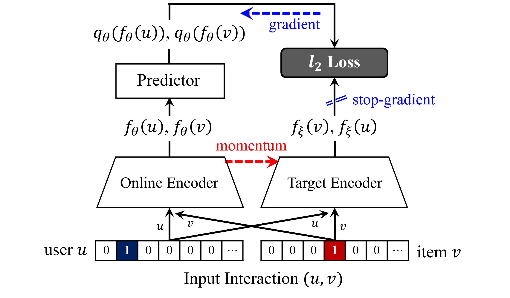

# BUIR: Bootstrapping User and Item Representations for One-Class Collaborative Filtering

- This is the author code of ["Bootstrapping User and Item Representations for One-Class Collaborative Filtering"](https://arxiv.org/abs/2105.06323) (SIGIR 2021).
- We provide two types of user/item encoder: 1) `BUIR-id` - a single embedding layer, and 2) `BUIR-nb` - the [LightGCN](https://arxiv.org/abs/2002.02126).

## Overview

<p align="center">

</p>

Our BUIR framework optimizes the representations of **positively-related users and items** (i.e., users and their highly preferred items) similar to each other, without explicitly using negative user-item interactions.

## Run the codes

- python
- pytorch

#### BUIR using a simple encoder (with a single embedding layer)
```
python main.py --dataset toy-dataset --model buir-id --gpu <gpu-device-idx>
```

#### BUIR using a GCN-based encoder
```
python main.py --dataset toy-dataset --model buir-nb --gpu <gpu-device-idx>
```

## Citation
```
@inproceedings{lee2021bootstrapping,
  title = {Bootstrapping User and Item Representations for One-Class Collaborative Filtering},
  author = {Lee, Dongha and Kang, SeongKu and Ju, Hyunjun and Park, Chanyoung and Yu, Hwanjo},
  booktitle = {Proceedings of the 44th International ACM SIGIR Conference on Research and Development in Information Retrieval},
  year = {2021},
  pages = {317–326}
}

```
